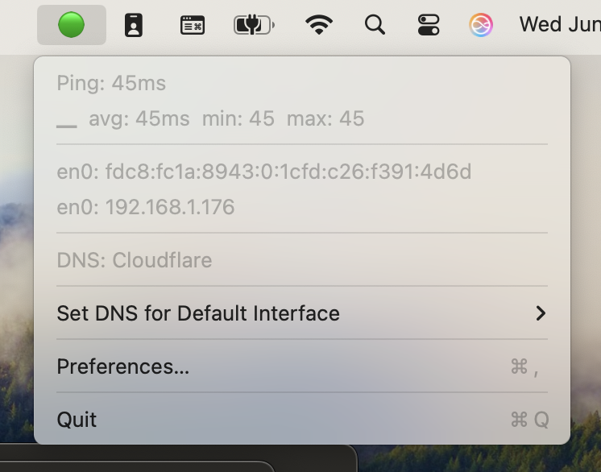
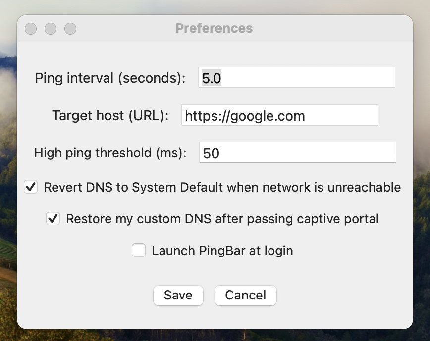

# PingBar

[](LICENSE)
[](https://www.apple.com/macos/)
[](https://swift.org)

PingBar is a modern, native macOS menu bar app that continuously monitors your network connectivity and DNS settings.

It provides real-time ping statistics, network interface information, and DNS management, all from your menu bar.

## Screenshots

### Main Menu



The main menu shows real-time network status with:

- Current ping time and status (🟢 for good connectivity)
- Sparkline graph with ping statistics (avg/min/max)
- Active network interfaces with IP addresses
- Current DNS resolver information
- Quick access to DNS management and preferences

### Preferences Window



The preferences window allows you to configure:
- Ping interval and target host
- High ping threshold for warnings
- DNS auto-revert behavior for captive portals
- Launch at login option

## Features

- **Live Network Status**: Pings a configurable host (default: Google) and shows status with colored icons (🟢/🟡/🔴/🟠) in the menu bar.
- **Historical Ping Graph**: Unicode sparkline graph and statistics (avg/min/max) for recent pings.
- **Network Interface Info**: Displays active local IP addresses with interface names.
- **DNS Resolver Display**: Shows current DNS resolvers for your default interface.
- **DNS Management**: Change DNS for your default interface with one click (System Default, Cloudflare, Google, Quad9, 114DNS, dnscrypt-proxy, etc.).
- **Captive Portal Detection**: Detects captive portals and can auto-revert DNS to default, restoring your custom DNS after login.
- **Preferences Dialog**: Configure ping interval, target host, high ping threshold, DNS auto-revert, and launch at login.
- **Auto-Start**: Optionally launch PingBar at login using a LaunchAgent.
- **macOS Native**: Built with Swift, AppKit, and SwiftPM. No Electron, no bloat.

## Installation

### Download

Download the latest release from the [Releases](https://github.com/jedisct1/pingbar/releases) page.

### Build from Source

#### Requirements

- macOS 12.0+ (Monterey) recommended
- Xcode 14+ or Swift 6.1+
- Command line tools: `swift`, `codesign` (for signing)

#### Quick Start

```sh
git clone https://github.com/jedisct1/pingbar.git
cd pingbar
./bundle_pingbar_app.sh
```

The built app will appear as `PingBar.app` in the project directory.

#### Development

```sh
# Clone the repository
git clone https://github.com/jedisct1/pingbar.git
cd pingbar

# Build debug version
swift build

# Build release version
swift build -c release

# Run tests
swift test

# Create app bundle
./bundle_pingbar_app.sh

```

## Usage

### Getting Started

1. **Launch PingBar**: Double-click `PingBar.app` or run from the command line
2. **Menu Bar Icon**: Look for the colored icon in your menu bar (🟢/🟡/🔴/🟠)
3. **Click the Icon**: View network status, ping statistics, and current settings
4. **Configure Settings**: Select "Preferences…" to customize behavior

### Menu Overview

- **Network Status**: Current ping time and connection status
- **Ping Graph**: Visual sparkline showing recent ping history with statistics
- **Network Interfaces**: List of active network interfaces and their IP addresses
- **DNS Servers**: Current DNS resolvers for your default interface
- **DNS Management**: Quick access to change DNS settings
- **Preferences**: Configure all app settings

### DNS Management

PingBar provides one-click DNS switching for your default network interface:

- **System Default**: Use your network's default DNS
- **Cloudflare (1.1.1.1)**: Fast, privacy-focused DNS
- **Google (8.8.8.8)**: Reliable public DNS
- **Quad9 (9.9.9.9)**: Security-focused DNS with malware blocking
- **114DNS (114.114.114.114)**: Popular DNS service in China
- **dnscrypt-proxy (127.0.0.1)**: Local encrypted DNS proxy

⚠️ **Note**: DNS changes require administrator privileges. You'll be prompted for your password.

## Configuration

Access preferences via the menu bar icon → "Preferences…"

### Settings

| Setting                 | Description                                              | Default                |
| ----------------------- | -------------------------------------------------------- | ---------------------- |
| **Ping Interval**       | How often to ping the target (seconds)                   | 5.0                    |
| **Target Host**         | URL or IP to ping                                        | https://www.google.com |
| **High Ping Threshold** | Latency threshold for warning state (ms)                 | 200                    |
| **DNS Auto-Revert**     | Revert DNS to system default when network is unreachable | false                  |
| **Restore Custom DNS**  | Restore custom DNS after captive portal login            | false                  |
| **Launch at Login**     | Auto-start PingBar when you log in                       | false                  |

### Status Icons

| Icon | Status         | Description                              |
| ---- | -------------- | ---------------------------------------- |
| 🟢    | Good           | Network is responsive (ping < threshold) |
| 🟡    | Warning        | High latency (ping ≥ threshold)          |
| 🔴    | Bad            | Network unreachable or failed            |
| 🟠    | Captive Portal | Captive portal detected                  |

### Captive Portal Handling

When enabled, PingBar can automatically:

1. **Detect** captive portals (hotel/airport WiFi login pages)
2. **Revert** your custom DNS to system default to allow portal access
3. **Restore** your custom DNS after successful login

This ensures seamless connectivity while preserving your DNS preferences.

### Testing

```sh
# Run all tests
swift test

# Run specific test
swift test --filter TestName
```

## Troubleshooting

### Common Issues

**PingBar doesn't appear in menu bar**
- Ensure macOS 12.0+ is installed
- Check that the app has accessibility permissions if needed
- Try relaunching the app

**DNS changes don't work**
- Verify you have administrator privileges
- Check that `networksetup` command line tool is available
- Ensure your network interface is active

**App won't launch**
- Check Console.app for error messages
- Verify code signing if you built from source
- Try removing and reinstalling

### Performance Tips

- Use a reliable, fast target host for pinging
- Set reasonable ping intervals (5-10 seconds recommended)
- Enable launch at login for continuous monitoring

## Security

PingBar follows security best practices:

- **Minimal Permissions**: Only requests necessary system access
- **No Data Collection**: All data stays local on your device
- **Open Source**: Code is publicly auditable
- **Code Signing**: Release builds are signed and notarized

### Privacy

PingBar does not:

- Collect or transmit personal data
- Track your browsing habits
- Store sensitive information
- Connect to external services (except for ping tests)

## System Requirements

- **macOS**: 12.0 (Monterey) or later
- **Architecture**: Intel x64 or Apple Silicon (Universal Binary)
- **Memory**: 50MB RAM typical usage
- **Permissions**: Administrator access for DNS changes (optional)

## License

PingBar is released under the [MIT License](LICENSE).

## Acknowledgments

- Inspired by classic menu bar network tools like MenuMeters and iStat Menus
- Uses [Apple's AppKit](https://developer.apple.com/documentation/appkit) for native UI
- Built with [Swift Package Manager](https://swift.org/package-manager/)
- DNS management via `networksetup` and AppleScript
- Unicode sparkline graphs for visual ping history

---

**PingBar** — Network and DNS monitoring at a glance, right from your Mac menu bar. 🌐
